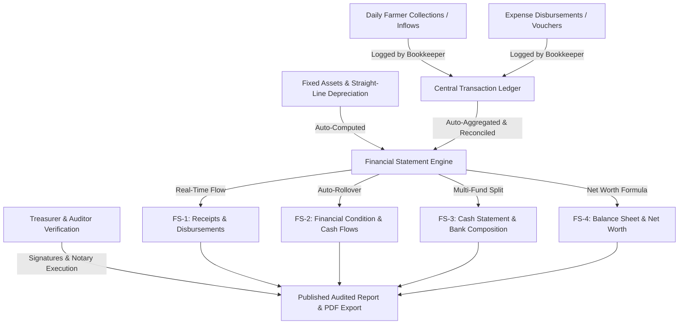

# IRRIGATORS ASSOCIATION RECORD MANAGEMENT SYSTEM (IARMS)
## Comprehensive System Guidebook & Financial Computation Manual
**Document Version:** 2.0 (Official NIA-SEC Statutory Release)  
**Mathematical Anchor & Case Study:** Nangurisan Laya Farmers Irrigators Association, Inc. (NLFIA)  
**System Standard:** National Irrigation Administration (NIA) Modified Irrigation Management Transfer (IMT) Contract & SEC-Compliant Financial Reporting

---

## 1. Executive Overview & System Architecture

### 1.1 Purpose and Statutory Context
The **Irrigators Association Record Management System (IARMS)** is an enterprise-grade cloud accounting and administrative platform designed specifically for Irrigators Associations (IAs) operating under the National Irrigation Administration (NIA) and registered with the Securities and Exchange Commission (SEC) and Bureau of Internal Revenue (BIR).

The platform transforms manual, error-prone paper ledgers into an automated, mathematically unified double-entry accounting engine. It ensures:
1. **Statutory NIA Compliance:** Native generation of the 5 official NIA financial statement packages (FS-1, FS-2, FS-3, FS-4, FS-5).
2. **Double-Entry Equilibrium:** Real-time alignment between the cash ledger, multi-fund bank accounts, fixed assets, liabilities, and members' equity.
3. **Audit Trail Integrity:** Strict multi-role segregation of duties with full voucher tracking and irreversible historical logs.

### 1.2 System Architecture & Flow

---

## 2. User Roles & Permission Matrix

The system enforces strict **Separation of Duties (SoD)** to prevent financial fraud and meet Philippine Commission on Audit (COA) and NIA guidelines:

| Role | Operational Scope | Can Add Transactions? | Can Edit Chart of Accounts? | Can Generate Statements? | Can Sign / Notarize? |
| :--- | :--- | :---: | :---: | :---: | :---: |
| **Super Admin** | System-wide oversight across all IAs, system configuration, database backup | Yes | Yes | Yes | Yes |
| **IA President** | Executive leadership, governance, administrative approval, signatory | View Only | View Only | View Only | Yes |
| **Bookkeeper / Encoder** | Daily recording of collections, expenses, vouchers, and asset registry | **Yes** | **Yes** | **Yes** | No |
| **Treasurer** | Fiduciary custodian of cash vault and bank accounts; certification signatory | View Only | View Only | View Only | **Yes** |
| **Auditor** | Independent verification, examination of receipts/vouchers, audit overrides | View Only | View Only | View Only | **Yes** |
| **Farmer Member** | View individual dues, payments, land parcel records, and published reports | No | No | No | No |

---

## 3. Module-by-Module Operational Handbook

### 3.1 Authentication & Association Scoping
1. Navigate to the Login screen.
2. Enter your authorized credentials (Email/Username and Password).
3. The system automatically scopes your dashboard to your assigned Irrigators Association. Super Admins have access to a global association dropdown selector in the top navigation bar.

### 3.2 Farmer Beneficiary & Land Registry
- **Adding a Member:** Navigate to **Members** &rarr; click **Add New Member**. Fill in First Name, Last Name, Contact Number, TIN, and Turnout Service Area Group (TSAG / Lateral).
- **Land Parcel Encoding:** Under the member's profile, click **Add Parcel**. Encode Farm Area (hectares), Lot Number, Cadastral Lot, Water Source (Lateral A, B, Main Canal), and Crop Classification (Rice, Corn, High Value).

### 3.3 Recording Collections (Money IN)
1. Navigate to **Transactions** &rarr; click **New Collection**.
2. **Required Fields:**
   - **Transaction Date:** Date payment was actually received.
   - **Farmer Beneficiary:** Select member from dropdown (or leave unassigned for institutional subsidies).
   - **Budget Category:** Select the appropriate income account (e.g., `REC-ISF`, `REC-MEM`, `REC-SUB`, `REC-CBU`, `REC-DON`).
   - **Amount (₱):** Numeric value received.
   - **Payment Method / Fund:** Select `Cash on Hand` (Physical Vault), `Bank Regular` (LBP / DBP Operating Account), or `Bank CBU` (Capital Build-Up Account).
   - **Reference / Receipt #:** Official Collection Receipt (CR) or Official Receipt (OR) series number.
3. Click **Save Transaction**. The ledger, cash balances, and financial statement drafts update instantly.

### 3.4 Recording Disbursements & Vouchers (Money OUT)
1. Navigate to **Transactions** &rarr; click **New Disbursement**.
2. **Required Fields:**
   - **Transaction Date:** Date payment or release was made.
   - **Disbursement Voucher #:** DV number (e.g., `DV-2026-001`).
   - **Check # / Reference:** Bank check number or cash release slip.
   - **Budget Category:** Select expense account (e.g., `DISB-CLEAR`, `DISB-HON`, `DISB-SUPP`, `DISB-REPAIR`, `DISB-TAX`).
   - **Amount (₱):** Actual disbursement.
   - **Payment Source:** Cash on Hand, Bank Regular, or Bank CBU.
   - **Particulars:** Clear operational justification (e.g., *Canal desilting along Lateral B Station 0+500*).
3. Click **Save Disbursement**. The system credits cash/bank and debits the designated expense account.

### 3.5 Chart of Accounts Governance
The system comes pre-configured with the **21 Official NIA Statutory Accounts**.
- **Soft Deactivation:** If an association does not utilize a specific statutory account, toggling it "Inactive" hides it from the transaction dropdown without breaking existing ledger records.
- **Statutory Protection:** Core NIA accounts cannot be permanently deleted.
- **One-Click Restore:** If standard accounts are missing, clicking **Restore Standard Accounts** regenerates all 21 official accounts in under a second.

### 3.6 Fixed Asset Registry & Straight-Line Depreciation
1. Navigate to **Fixed Assets** &rarr; click **Add Asset**.
2. Encode Asset Name, Serial Number, Date Acquired, Acquisition Cost (₱), Useful Life (Years), and Salvage Value.
3. The system automatically executes straight-line monthly and annual depreciation:
   $$\text{Annual Depreciation} = \frac{\text{Acquisition Cost} - \text{Salvage Value}}{\text{Useful Life (Years)}}$$
   $$\text{Net Book Value (NBV)} = \text{Acquisition Cost} - \text{Accumulated Depreciation}$$
4. NBV is automatically transmitted to **FS-2 (Non-Current Assets)** and **FS-4 (Fixed Assets)**.

---

## 4. Comprehensive Automated vs. Manual Breakdown

The table below provides a complete audit of every single field across the financial statements, specifying whether it is automated or manual, and providing the statutory and operational justification.

### 4.1 Summary Table Across All Statements

| Statement | Field / Line Item | Mode | Data Origin & Formula | Why is it Manual? (Operational / Statutory Rationale) |
| :--- | :--- | :---: | :--- | :--- |
| **FS-1** | Membership Fees | **Automated** | $\sum \text{Collections tagged } \texttt{REC-MEM}$ | Fully automated from official membership receipts. |
| **FS-1** | Annual Dues | **Automated** | $\sum \text{Collections tagged } \texttt{REC-DUE}$ | Fully automated from annual dues ledger. |
| **FS-1** | O&M Subsidy (ISF + Subsidy) | **Automated** | $\sum \text{Collections tagged } \texttt{REC-ISF} + \texttt{REC-SUB}$ | Fully automated from NIA subsidy advice & dry/wet season ISF. |
| **FS-1** | Canal Remuneration Incentive | **Automated** | $\sum \text{Collections tagged } \texttt{REC-REMU}$ | Fully automated from NIA performance incentive releases. |
| **FS-1** | Fines & Penalties | **Automated** | $\sum \text{Collections tagged } \texttt{REC-FIN}$ | Fully automated from water violation penalties and bank interest. |
| **FS-1** | Other Income / Grants | **Automated** | $\sum \text{Collections tagged } \texttt{REC-DON} + \text{Custom Extra Receipts}$ | Fully automated from LGU grants and miscellaneous donations. |
| **FS-1** | **Total Receipts** | **Automated** | $\sum \text{All Valid Inflow Line Items}$ | **LOCKED.** System strictly prohibits manual overrides to prevent unbalanced books. |
| **FS-1** | Registration & Permit Fees | **Automated** | $\sum \text{Disbursements tagged } \texttt{DISB-TAX}$ | Fully automated from SEC, BIR, and municipal permit vouchers. |
| **FS-1** | Travel & Representation | **Automated** | $\sum \text{Disbursements tagged } \texttt{DISB-TRAV}$ | Fully automated from official travel vouchers. |
| **FS-1** | Meeting Expenses | **Automated** | $\sum \text{Disbursements tagged } \texttt{DISB-MEET}$ | Fully automated from General Assembly meal vouchers. |
| **FS-1** | Office Equipment & Supplies | **Automated** | $\sum \text{Disbursements tagged } \texttt{DISB-SUPP}$ | Fully automated from stationery and field supply invoices. |
| **FS-1** | Honorarium, Salaries & Wages | **Automated** | $\sum \text{Disbursements tagged } \texttt{DISB-HON}$ | Fully automated from monthly gatekeeper and officer payroll vouchers. |
| **FS-1** | Canal Clearing & Maintenance | **Automated** | $\sum \text{Disbursements tagged } \texttt{DISB-CLEAR}$ | Fully automated from canal desilting and clearing payroll. |
| **FS-1** | Emergency Canal Gate Repairs | **Automated** | $\sum \text{Disbursements tagged } \texttt{DISB-REPAIR}$ | Fully automated from welder and cement repair receipts. |
| **FS-1** | Professional CPA Fee | **Automated** | $\sum \text{Disbursements tagged } \texttt{DISB-PROF}$ | Fully automated from CPA audit retaining fee vouchers. |
| **FS-1** | Federation Contribution Share | **Automated** | $\sum \text{Disbursements tagged } \texttt{DISB-FED}$ | Fully automated from Baua River IA Federation remittances. |
| **FS-1** | Piso Mula sa Puso Emergency Fund | **Automated** | $\sum \text{Disbursements tagged } \texttt{DISB-PISO}$ | Fully automated from community welfare releases. |
| **FS-1** | Lateral / TSAG Incentive Share | **Automated** | $\sum \text{Disbursements tagged } \texttt{DISB-LATERAL}$ | Fully automated from turnout service group distributions. |
| **FS-1** | Other / Miscellaneous Expenses | **Automated** | $\sum \text{Disbursements tagged } \texttt{DISB-MISC} + \text{Custom Extra Lines}$ | Fully automated from petty expenses. |
| **FS-1** | **Total Disbursements** | **Automated** | $\sum \text{All Valid Outflow Line Items}$ | **LOCKED.** Strictly auto-computed. |
| **FS-1** | **Net Operating Surplus** | **Automated** | $\text{Total Receipts} - \text{Total Disbursements}$ | **LOCKED.** Pure mathematical delta. |
| **FS-1** | Fund Balance, Beginning | **Automated** | $\text{Net Surplus of Prior Year (Rollover)}$ | Fully automated from previous fiscal period closing. |
| **FS-1** | **Fund Balance, End** | **Automated** | $\text{Fund Balance Beginning} + \text{Net Surplus Current}$ | **LOCKED.** Cumulative operating reserve. |
| **FS-2** | Cash Flows from Operations | **Automated** | Transferred directly from FS-1 Net Surplus | Exact mirror of FS-1 operating result. |
| **FS-2** | Depreciation of Non-Current Assets | **Automated** | $\sum \text{Annual Depreciation from Fixed Asset Registry}$ | Straight-line formula computed from asset acquisition date and lifespan. |
| **FS-2** | Cash Balance, Beginning | **Automated** | Transferred directly from FS-1 Fund Balance Beginning | Exact mirror of prior year ending cash. |
| **FS-2** | Cash Balance, End | **Automated** | $\text{Cash Balance Beginning} + \text{Net Surplus Current}$ | Reconciles to the last centavo with the physical bank accounts. |
| **FS-2** | Current Assets (Cash & Receivables) | **Automated** | Transferred from FS-2 Cash Balance End | Represents liquid operational cash. |
| **FS-2** | Non-Current Assets (IA Office Building) | **Automated** | Net Book Value (NBV) of Office Building & Fixed Assets | Auto-pulled from asset registry (₱714,000.00 NBV for NLFIA). |
| **FS-2** | **Total Assets** | **Automated** | $\text{Current Assets} + \text{Non-Current Assets}$ | Combined wealth of the association. |
| **FS-2** | Current Liabilities (Accrued Wages) | **Automated** | $\sum \text{Vouchers tagged } \texttt{LIAB-CUR-WAGES} \text{ or Current Liability}$ | Auto-aggregated from unpaid operational obligations. |
| **FS-2** | Non-Current Liabilities (Loan Payable) | **Automated** | $\sum \text{Vouchers tagged } \texttt{LIAB-NONCUR-LOAN}$ | Auto-aggregated from long-term financing debts. |
| **FS-2** | Members' Equity | **Automated** | $\text{Total Assets} - \text{Total Liabilities}$ | Represents net members' residual stake. |
| **FS-2** | **Total Liabilities & Members' Equity**| **Automated** | $\text{Total Liabilities} + \text{Members' Equity}$ | **LOCKED.** Strictly equals Total Assets. |
| **FS-3** | Section A (Cash Receipts Breakdown)| **Automated** | Mirror of FS-1 Receipts Lines | 1-to-1 reflection of all validated inflow vouchers. |
| **FS-3** | Section B (Disbursements Breakdown) | **Automated** | Mirror of FS-1 Disbursements Lines | 1-to-1 reflection of all validated outflow vouchers. |
| **FS-3** | Section C (Cash Balance This Year) | **Automated** | Current Year Receipts minus Current Year Disbursements | Net change in cash for the reporting period. |
| **FS-3** | Section D (Fund Balance Last Report)| **Automated** | Rolled over from prior year closing | Verified unspent cash brought forward. |
| **FS-3** | Section E (Total Cash Balance) | **Automated** | $\text{Section C} + \text{Section D}$ | Reconciled total liquid funds. |
| **FS-3** | Sec. F: Cash on Hand (Petty/Vault) | **Automated** | Cumulative inflows minus outflows tagged `cash_on_hand` | Auto-tracked physical vault cash. |
| **FS-3** | Sec. F: Cash in Bank - Regular | **Automated** | Cumulative inflows minus outflows tagged `bank_regular` | Auto-tracked Land Bank of the Philippines operational checking account. |
| **FS-3** | Sec. F: Cash in Bank - CBU | **Automated** | Cumulative inflows minus outflows tagged `bank_cbu` | Auto-tracked restricted Capital Build-Up bank savings account. |
| **FS-3** | **Sec. F: Total Cash Composition** | **Automated** | $\text{Cash on Hand} + \text{Bank Regular} + \text{Bank CBU}$ | **Must exactly equal Section E.** |
| **FS-4** | Cash on Hand & in Bank | **Automated** | Transferred directly from FS-3 Section F | Liquid assets transferred to the Balance Sheet. |
| **FS-4** | Non-Current Assets (Fixed Assets NBV) | **Automated** | Transferred directly from Fixed Asset Registry | Net book value of IA office building, pump stations, and tools. |
| **FS-4** | Current & Long-Term Liabilities | **Automated** | Sum of Current & Non-Current Liabilities from Ledger | Total debt obligations owed to third parties. |
| **FS-4** | **Net Worth** | **Automated** | $\text{Total Assets} - \text{Total Liabilities}$ | True legal net worth of the association. |
| **FS-4** | Treasurer Certification Block | **Automated** | Pulled from Association Profile (Name, TIN) | Verified officer credentials. |
| **FS-4** | **Community Tax Certificate (CTC) #** | **MANUAL** | User typed in modal during notary filing | **LEGAL REQUIREMENT:** Philippine Notarial Law (A.M. No. 02-8-13-SC) requires the physical Community Tax Certificate (Cedula) or Government Passport/Driver's License presented in person before the Notary Public. Software cannot fabricate legal identity documents. |
| **FS-4** | **CTC Date & Place of Issue** | **MANUAL** | User typed in modal during notary filing | **LEGAL REQUIREMENT:** Must reflect the physical municipality where the Treasurer paid their annual local community tax. |
| **FS-1..4**| **Auditor Discretionary Overrides** | **MANUAL** | Inline click-to-edit pencil tool (Auditor only) | **ACCOUNTING STANDARDS (PFRS for SMEs):** Certified Public Accountants (CPAs) require audit adjustment journal entries (e.g., physical inventory shrinkage write-down, unbilled legal accruals) discovered after the ledger has been closed for the year. |

---

## 5. Concrete Mathematical Proof & Computation Engine
### Case Study: Nangurisan Laya Farmers Irrigators Association, Inc. (NLFIA)

To prove that the generated Financial Statements are 100% interconnected with the underlying database transactions, this section walks through the complete mathematical derivation using the live NLFIA dataset.

### 5.1 Association Profile
- **Association Name:** Nangurisan Laya Farmers Irrigators Association, Inc.
- **Office Address:** Sta. Cruz, Gonzaga, Cagayan
- **Irrigation System:** Baua River Irrigation System
- **SEC Registration:** CN202060557 | **TIN:** 769-207-601-000
- **President:** Meynard A. Tomaneng | **Treasurer:** Ric Unday | **Auditor:** Artur Guiang
- **Total Beneficiaries:** 75 Farmers | **Service Area:** 88.41 Hectares

---

### 5.2 The Underlying Transactions (29 Ledger Vouchers)

#### Phase I: Prior Year (2025) Ledger Transactions
The 2025 transactions establish the historical baseline and calculate the **Beginning Cash Balance** and **Fund Balance Last Report** for 2026.

| Voucher # | Date | Category & Code | Type | Payment Fund | Particulars | Amount (₱) |
| :--- | :--- | :--- | :--- | :--- | :--- | :---: |
| `CR-2025-001` | 2025-03-10 | `REC-MEM` (Membership) | Collection | `cash_on_hand` | 2025 Annual Membership Fees | ₱24,000.00 |
| `CR-2025-002` | 2025-05-15 | `REC-ISF` (ISF Dry Season) | Collection | `cash_on_hand` | Irrigation Service Fee Dry Season | ₱195,000.00 |
| `CR-2025-003` | 2025-06-20 | `REC-SUB` (NIA Subsidy) | Collection | `bank_regular` | NIA Canal O&M Subsidy Release | ₱140,000.00 |
| `CR-2025-004` | 2025-09-12 | `REC-FIN` (Fines & Interest) | Collection | `bank_regular` | Surcharges & Bank Interest | ₱6,000.00 |
| `CR-2025-005` | 2025-11-28 | `REC-DON` (LGU Grant) | Collection | `bank_regular` | Municipal Fuel Assistance Grant | ₱25,000.00 |
| `DV-2025-001` | 2025-04-18 | `DISB-CLEAR` (Canal Maint.) | Disbursement | `cash_on_hand` | Lateral Canal Desilting Labor | ₱85,000.00 |
| `DV-2025-002` | 2025-07-22 | `DISB-HON` (Wages) | Disbursement | `cash_on_hand` | 2025 Officers & Tender Honorarium | ₱50,000.00 |
| `DV-2025-003` | 2025-08-14 | `DISB-SUPP` (Supplies) | Disbursement | `cash_on_hand` | Office Stationery & Materials | ₱12,000.00 |
| `DV-2025-004` | 2025-10-10 | `DISB-REPAIR` (Repairs) | Disbursement | `bank_regular` | Station B Steel Gate Repair | ₱28,000.00 |
| `DV-2025-005` | 2025-12-05 | `DISB-TAX` (Taxes & Permits) | Disbursement | `bank_regular` | SEC & Municipal Registration | ₱15,000.00 |

$$\text{2025 Total Collections} = 24,000 + 195,000 + 140,000 + 6,000 + 25,000 = \mathbf{₱390,000.00}$$
$$\text{2025 Total Disbursements} = 85,000 + 50,000 + 12,000 + 28,000 + 15,000 = \mathbf{₱190,000.00}$$
$$\mathbf{2025 \text{ Net Operating Surplus}} = 390,000.00 - 190,000.00 = \mathbf{₱200,000.00}$$

> [!IMPORTANT]
> This ₱200,000.00 net operating surplus automatically rolls over into 2026 as:
> 1. **FS-1:** `membersEquity.fundBalanceBeginning` = ₱200,000.00
> 2. **FS-2:** `cashFlows.cashBalanceBeginning` = ₱200,000.00
> 3. **FS-3:** `fundBalanceLastReport` = ₱200,000.00

---

#### Phase II: Current Year (2026) Ledger Transactions

| Voucher # | Date | Category & Code | Type | Fund Source | Particulars | Amount (₱) |
| :--- | :--- | :--- | :--- | :--- | :--- | :---: |
| `CR-2026-001` | 2026-01-15 | `REC-MEM` | Collection | `cash_on_hand` | 2026 Annual Membership Renewals | ₱18,000.00 |
| `CR-2026-002` | 2026-02-10 | `REC-CBU` | Collection | `bank_cbu` | Member Capital Build-Up (CBU) | ₱45,000.00 |
| `CR-2026-003` | 2026-02-28 | `REC-ISF` | Collection | `cash_on_hand` | Dry Season ISF Collections | ₱185,000.00 |
| `CR-2026-004` | 2026-03-05 | `REC-SUB` | Collection | `bank_regular` | NIA O&M Canal Subsidy (1st Tranche)| ₱95,000.00 |
| `CR-2026-005` | 2026-03-12 | `REC-FIN` | Collection | `cash_on_hand` | Water Scheduling Fines & Penalties | ₱7,500.00 |
| `CR-2026-006` | 2026-03-18 | `REC-DON` | Collection | `bank_regular` | LGU Gonzaga Canal Grant | ₱30,000.00 |
| **Subtotal** | | **2026 Collections** | | | | **₱380,500.00** |
| `DV-2026-001` | 2026-01-20 | `DISB-CLEAR`| Disbursement | `cash_on_hand` | Lateral Canal Clearing Labor | ₱42,000.00 |
| `DV-2026-002` | 2026-02-05 | `DISB-HON` | Disbursement | `cash_on_hand` | Gatekeepers & Officers Honorarium | ₱38,000.00 |
| `DV-2026-003` | 2026-02-14 | `DISB-SUPP` | Disbursement | `cash_on_hand` | Office Supplies & Field Tools | ₱9,500.00 |
| `DV-2026-004` | 2026-02-22 | `DISB-TRAV` | Disbursement | `cash_on_hand` | General Assembly Travel & Meals | ₱14,000.00 |
| `DV-2026-005` | 2026-03-02 | `DISB-REPAIR`| Disbursement | `bank_regular` | Main Canal Gate Repair & Welding | ₱32,000.00 |
| `DV-2026-006` | 2026-03-08 | `DISB-TAX` | Disbursement | `bank_regular` | LGU Permits & SEC Compliance | ₱8,500.00 |
| `DV-2026-007` | 2026-03-15 | `DISB-LATERAL`| Disbursement| `bank_regular` | Turnout Service Group Incentive | ₱25,000.00 |
| `DV-2026-008` | 2026-03-19 | `DISB-PROF` | Disbursement | `bank_regular` | Certified Public Accountant Fee | ₱18,000.00 |
| `DV-2026-009` | 2026-03-22 | `DISB-FED` | Disbursement | `bank_regular` | Baua River IA Federation Share | ₱20,000.00 |
| `DV-2026-010` | 2026-03-25 | `DISB-PISO` | Disbursement | `cash_on_hand` | Piso Mula sa Puso Emergency Fund | ₱3,000.00 |
| `DV-2026-011` | 2026-03-28 | `DISB-MISC` | Disbursement | `cash_on_hand` | Bank Fees & Communication | ₱3,000.00 |
| `DV-2026-012` | 2026-03-29 | `LIAB-CUR-WAGES`| Disbursement | `cash_on_hand` | Accrued Wages Liability Obligation | ₱16,500.00 |
| `DV-2026-013` | 2026-03-30 | `LIAB-NONCUR-LOAN`| Disbursement| `bank_regular` | Long-Term Facility Loan Amortization | ₱15,500.00 |
| **Subtotal** | | **2026 Disbursements** | | | | **₱245,000.00** |

$$\mathbf{2026 \text{ Net Operating Surplus}} = ₱380,500.00 - ₱245,000.00 = \mathbf{₱135,500.00}$$

---

### 5.3 Step-by-Step Report Connection & Proof

#### Step 1: FS-1 (Comparative Statement of Cash Receipts & Disbursements)
- **Current Year Total Receipts:** $\mathbf{₱380,500.00}$ (Prior Year: ₱390,000.00)
- **Current Year Total Disbursements:** $\mathbf{₱245,000.00}$ (Prior Year: ₱190,000.00)
- **Net Operating Surplus:** $380,500.00 - 245,000.00 = \mathbf{₱135,500.00}$
- **Members' Equity Roll-Forward:**
  $$\text{Fund Balance Beginning (Rollover from 2025 Net)} = \mathbf{₱200,000.00}$$
  $$\text{Add: Net Savings for the Year (2026)} = \mathbf{₱135,500.00}$$
  $$\mathbf{Fund\ Balance\ End\ (December\ 31,\ 2026)} = 200,000.00 + 135,500.00 = \mathbf{₱335,500.00}$$

#### Step 2: FS-3 (Cash Statement & Bank Reconciliation)
- **Section C (Cash Balance This Year):** $₱380,500.00 - ₱245,000.00 = \mathbf{₱135,500.00}$
- **Section D (Add: Fund Balance Last Report):** $\mathbf{₱200,000.00}$
- **Section E (Total Cash Balance):** $135,500.00 + 200,000.00 = \mathbf{₱335,500.00}$
- **Section F (Composition of Cash Balance by Account):**
  $$\text{Cash on Hand (Vault)} = \sum \text{Inflows} - \sum \text{Outflows (tagged cash\_on\_hand)} = \mathbf{₱151,000.00}$$
  $$\text{Cash in Bank - Regular Operations} = \sum \text{Inflows} - \sum \text{Outflows (tagged bank\_regular)} = \mathbf{₱139,500.00}$$
  $$\text{Cash in Bank - Capital Build-Up (CBU)} = \sum \text{Inflows} - \sum \text{Outflows (tagged bank\_cbu)} = \mathbf{₱45,000.00}$$
  $$\mathbf{Total\ Section\ F\ Cash\ Composition} = 151,000.00 + 139,500.00 + 45,000.00 = \mathbf{₱335,500.00}$$
  $$\mathbf{Mathematical\ Verification:\ Section\ E\ (₱335,500.00) \equiv Section\ F\ (₱335,500.00) \quad [100\%\ MATCH]}$$

#### Step 3: FS-2 (Statement of Financial Condition) & FS-4 (Balance Sheet)
- **Current Assets:** Cash in Banks & on Hand = $\mathbf{₱335,500.00}$
- **Non-Current Assets:**
  - `IA OFFICE BUILDING` (Acquisition ₱850,000 - Acc. Dep. ₱136,000) = $\mathbf{₱714,000.00}$
  $$\mathbf{Total\ Assets} = 335,500.00 + 714,000.00 = \mathbf{₱1,049,500.00}$$
- **Liabilities:**
  - Current Liabilities (Accrued Wages / Payables) = $\mathbf{₱16,500.00}$
  - Non-Current Liabilities (Long-Term Facility Loan) = $\mathbf{₱35,000.00}$
  $$\mathbf{Total\ Liabilities} = 16,500.00 + 35,000.00 = \mathbf{₱51,500.00}$$
- **Members' Equity & Net Worth Calculation:**
  $$\mathbf{Net\ Worth\ (FS-4)} = \text{Total Assets} - \text{Total Liabilities} = 1,049,500.00 - 51,500.00 = \mathbf{₱998,000.00}$$
- **Balance Sheet Equilibrium Proof:**
  $$\text{Total Liabilities} + \text{Members' Equity} = 51,500.00 + 998,000.00 = \mathbf{₱1,049,500.00}$$
  $$\mathbf{Total\ Assets\ (₱1,049,500.00) \equiv Total\ Liabilities\ \&\ Equity\ (₱1,049,500.00) \quad [PERFECT\ BALANCE]}$$

---

## 6. Audit & Reconciliation Troubleshooting Guide

### 6.1 What happens if a Chart of Account is edited or renamed after transactions are logged?
The system utilizes a relational foreign-key database architecture (`category_id` &rarr; `budget_categories.id`).
- Renaming an account (e.g., from *Canal Desilting* to *Canal Desilting & Trimming*) updates the account label retroactively across all reports without losing transaction integrity.
- In FS-1, standard lines remain bound to their official statutory positions, while the descriptive display label updates.

### 6.2 What happens if an account is accidentally deleted?
1. **Statutory Account Protection:** The system's API rejects deletion requests for the 21 standard NIA accounts.
2. **Ledger Integrity Constraint:** If an account contains existing transactions, deletion is blocked by foreign key constraints. The system prompts the user to **Deactivate** the account instead.
3. **One-Click Restore:** If a custom category is wiped or an association was initialized with an empty chart, administrators can click **Restore Standard Accounts** on the Chart of Accounts page to automatically reinstate all 21 NIA statutory accounts.

### 6.3 Multi-Association Tenant Scoping
Each association possesses an isolated namespace (`association_id`). Transactions, members, land parcels, fixed assets, and financial reports from NLFIA can never cross-pollinate with another Irrigators Association.

---

## 7. Official Document Sign-Off & Notarization Workflow

When an annual statement is ready for submission to NIA, SEC, and BIR:
1. **Compilation:** The Bookkeeper clicks **Generate Statement** &rarr; selects **Comparative Reporting Period** &rarr; clicks **Compile**.
2. **Review:** The Auditor inspects the statements. If an off-ledger CPA adjustment is needed, the Auditor toggles **Edit Mode**, inputs the certified override, and clicks **Save Changes**. All dependent sheets auto-recompute immediately.
3. **Fiduciary Certification:** The Treasurer reviews Section F (Cash Composition) against physical Land Bank passbooks and signs the certification block.
4. **Notary Acknowledgment:** The Treasurer enters the Community Tax Certificate (CTC / Cedula) Number, Date of Issue, and Place of Issue in the FS-4 Notary Modal.
5. **Print & PDF Export:** Click the **Printer / PDF Export** button to generate the crisp, borderless, audit-ready physical document package.
